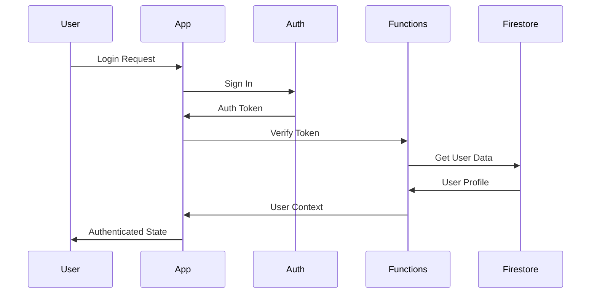
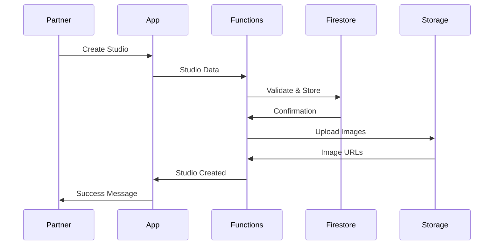

# Architecture and System Interactions

This document outlines the architecture and interaction patterns of the Naadi platform, including both the Expo frontend and Firebase backend components.

## 1. System Overview

### 1.1 High-Level Architecture

```
┌─────────────────┐     ┌─────────────────┐     ┌─────────────────┐
│   Expo Client   │     │  Firebase Auth  │     │  Cloud Storage  │
│  (User/Partner) │◄───►│                 │◄───►│                 │
└─────────────────┘     └─────────────────┘     └─────────────────┘
         ▲                       ▲                       ▲
         │                       │                       │
         ▼                       ▼                       ▼
┌─────────────────┐     ┌─────────────────┐     ┌─────────────────┐
│  Expo Router    │     │  Cloud Functions│     │   Firestore     │
│                 │◄───►│                 │◄───►│                 │
└─────────────────┘     └─────────────────┘     └─────────────────┘
```

### 1.2 Component Responsibilities

1. **Expo Client**
   - User interface rendering
   - State management
   - Navigation handling
   - API communication

2. **Firebase Services**
   - Authentication
   - Data storage
   - File storage
   - Serverless functions

3. **Cloud Functions**
   - Business logic
   - Data validation
   - Event handling
   - Security enforcement

## 2. Data Flow

### 2.1 Authentication Flow



### 2.2 Studio Management Flow



## 3. Component Interactions

### 3.1 Frontend Components

#### 3.1.1 Navigation Structure

```
app/
├── (main)/
│   ├── (protected)/
│   │   ├── home.tsx
│   │   ├── profile.tsx
│   │   └── bookings.tsx
│   ├── login.tsx
│   └── register.tsx
├── partners/
│   ├── (protected)/
│   │   ├── dashboard.tsx
│   │   ├── studios.tsx
│   │   └── classes.tsx
│   ├── login.tsx
│   └── register.tsx
└── _layout.tsx
```

#### 3.1.2 State Management

```typescript
// src/contexts/AuthContext.tsx
interface AuthState {
  user: User | null;
  role: 'user' | 'partner' | 'admin';
  loading: boolean;
}

// src/contexts/StudioContext.tsx
interface StudioState {
  studios: Studio[];
  selectedStudio: Studio | null;
  loading: boolean;
}
```

### 3.2 Backend Components

#### 3.2.1 Cloud Functions Structure

```
cloud-functions/
├── functions/
│   ├── src/
│   │   ├── auth/
│   │   │   ├── onUserCreated.ts
│   │   │   └── onUserDeleted.ts
│   │   ├── studios/
│   │   │   ├── createStudio.ts
│   │   │   └── updateStudio.ts
│   │   └── bookings/
│   │       ├── createBooking.ts
│   │       └── updateBooking.ts
│   └── utils/
│       ├── auth.ts
│       └── validation.ts
```

#### 3.2.2 Firestore Collections

```typescript
interface User {
  uid: string;
  email: string;
  role: 'user' | 'partner' | 'admin';
  displayName?: string;
  profilePic?: string;
  createdAt: Timestamp;
  updatedAt: Timestamp;
}

interface Studio {
  id: string;
  businessId: string;
  name: string;
  location: {
    lat: number;
    lng: number;
  };
  address: string;
  description: string;
  photos: string[];
  status: 'active' | 'inactive';
  createdAt: Timestamp;
  updatedAt: Timestamp;
}

interface Class {
  id: string;
  studioId: string;
  name: string;
  description: string;
  schedule: {
    startTime: Timestamp;
    endTime: Timestamp;
    recurring: boolean;
    daysOfWeek?: number[];
  };
  capacity: number;
  price: number;
  status: 'active' | 'cancelled' | 'completed';
  createdAt: Timestamp;
  updatedAt: Timestamp;
}

interface Booking {
  id: string;
  userId: string;
  classId: string;
  studioId: string;
  status: 'confirmed' | 'cancelled' | 'completed';
  createdAt: Timestamp;
  updatedAt: Timestamp;
}
```

## 4. Security Model

### 4.1 Authentication

- Firebase Authentication for user management
- Custom claims for role-based access
- JWT tokens for session management

### 4.2 Authorization

```javascript
// Firestore Security Rules
rules_version = '2';
service cloud.firestore {
  match /databases/{database}/documents {
    function isAuthenticated() {
      return request.auth != null;
    }
    
    function isAdmin() {
      return isAuthenticated() && 
        request.auth.token.role == 'admin';
    }
    
    function isPartner() {
      return isAuthenticated() && 
        request.auth.token.role == 'partner';
    }
    
    function isOwner(userId) {
      return isAuthenticated() && 
        request.auth.uid == userId;
    }
  }
}
```

## 5. Error Handling

### 5.1 Frontend Error Handling

```typescript
// src/utils/errorHandling.ts
export class AppError extends Error {
  constructor(
    message: string,
    public code: string,
    public status: number
  ) {
    super(message);
  }
}

export const handleError = (error: unknown) => {
  if (error instanceof AppError) {
    // Handle known errors
    return error;
  }
  // Handle unknown errors
  return new AppError(
    'An unexpected error occurred',
    'UNKNOWN_ERROR',
    500
  );
};
```

### 5.2 Backend Error Handling

```typescript
// cloud-functions/functions/utils/errorHandling.ts
export class FunctionError extends Error {
  constructor(
    message: string,
    public code: string,
    public status: number
  ) {
    super(message);
  }
}

export const handleFunctionError = (error: unknown) => {
  if (error instanceof FunctionError) {
    return {
      error: {
        message: error.message,
        code: error.code,
        status: error.status
      }
    };
  }
  return {
    error: {
      message: 'Internal server error',
      code: 'INTERNAL_ERROR',
      status: 500
    }
  };
};
```

## 6. Performance Considerations

### 6.1 Frontend Optimization

- Lazy loading of routes
- Image optimization
- Caching strategies
- State management optimization

### 6.2 Backend Optimization

- Function cold start optimization
- Firestore query optimization
- Caching strategies
- Rate limiting

## 7. Monitoring and Logging

### 7.1 Frontend Monitoring

- Error tracking
- Performance monitoring
- User analytics
- Crash reporting

### 7.2 Backend Monitoring

- Function execution metrics
- Database performance
- Error tracking
- Usage analytics

## 8. Deployment Strategy

### 8.1 Frontend Deployment

- EAS Build for app variants
- Staging and production environments
- Feature flags
- A/B testing capability

### 8.2 Backend Deployment

- Cloud Functions deployment
- Database migrations
- Security rules updates
- Environment configuration 